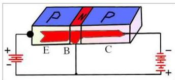
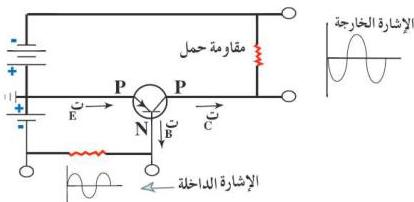

هذه الإلكترونات مع عدد مساوٍ لها من الفجوات الموجبة التي تعبر وصلة

(الباعث - القاعدة)
بعدد كبير جداً، أما ما
تبقى من هذه الفجوات
(وهو عدد كبير) فإنه
يندفع باتجاه المجمع، انظر
إلى الشكل (١٦).

- صغر المقاومة باتجاه (الباعث - المجمع) يسمح الشكل (١٦)

بمرور عدد كبير من الفجوات الموجبة إلى المجمع لكبر مساحته، وكبر المقاومة
باتجاه القاعدة يجعل عدداً قليلاً جداً من الفجوات الموجبة تتجه إلى القاعدة،
وذلك بسبب صغر مساحة سطح القاعدة وقلة شوائبها.

### طريقة التكبير بالباعث المشترك :

Common Emitter Amplification Process

الشكل (١٧) دائرة الترانزستور PNP ذي الباعث المشترك

كما هو واضح من الشكل (١٧)، في هذه الطريقة يكون الباعث مشتركاً بين
الإشارة الداخلة والإشارة الخارجة (القدرة أو الجهد أو التيار الكهربائي) والتي تكون
مكبرة بالنسبة للإشارة الكهربائية الداخلة.

ومن مزايا هذه الطريقة ما يأتي:

- يكون معامل تكبير التيار ($\frac{\text{ت خروج}}{\text{ت دخول}}$) عالياً لأن تيار المجمع أكبر بكثير من تيار القاعدة.

٧٧

http://www.e-learning-moe.edu.ye/