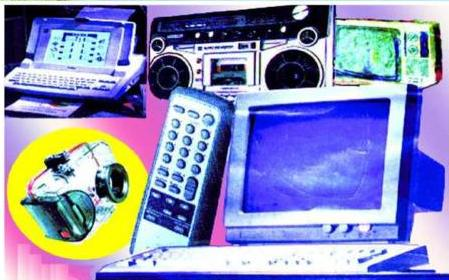

الأجهزة الإلكترونية
Electronic Devices

الوحدة
الرابعة

# أهداف الوحدة

يتوقع من الطالب بعد الانتهاء من دراسة هذه الوحدة أن يكون قادراً على أن:
١- يُعرف الآتي: الانبعاث الإلكتروني الثانوي، الانبعاث الإلكتروني الحراري، التفريغ الكهربائي خلال الغازات، أشعة الكاثود، الإرسال والاستقبال الإذاعي والتلفازي، المسح التلفازي.
٢- يصف مستعيناً بالرسم التوضيحي تركيب كل من: أنبوبة أشعة الكاثود، الأسيلسكوب، الرادار، مكبر الصوت الديناميكي، الإيكونوسكوب، شبكة الإرسال وشبكة الاستقبال الإذاعي، شبكة الإرسال وشبكة الاستقبال التلفازي.
٣- يشرح مراحل عمليتي الإرسال والاستقبال الإذاعي والتلفازي.
٤- يقارن بين عمليتي الإرسال والاستقبال في التلفاز العادي والتلفاز الملون.
٥- يذكر استخدامات كل من: الأسيلسكوب، الرادار، والملفات الحارقة في أنبوبة أشعة الكاثود.
٦- يشرح عمل مكبر الصوت الديناميكي في جهاز الاستقبال الإذاعي.
٧- يقدر جهود العلماء في مجال الصناعات الإلكترونية.
٨- يبين أثر الأجهزة الإلكترونية على تطور وتقدم البشرية، وفي تسهيل الحياة المعاصرة.

٨٥

http://www.e-learning-moe.edu.ye/