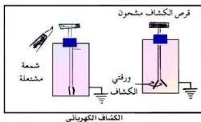

في هذه الوحدة سنستعرض بعضاً من الأجهزة الإلكترونية المستخدمة في الحياة مثل الرادار والراديو والتلفاز العادي والملون، والتي تُعد بعضاً من التطبيقات لما درسته في الوحدة السابقة مثل الوصلة الثنائية والترانزستور ودوائر التكبير الخاصة به، ولكن قبل التطرق إلى دراسة هذه الأجهزة الإلكترونية، يتحتم علينا إعطاء نبذة علمية عن التوصيل الكهربائي خلال الغازات (أي التفريغ الكهربائي في الغازات). لقد تعرفت من خلال دراستك للوحدة السابقة، أن هناك مواداً جيدة التوصيل للكهرباء ومواداً رديئة التوصيل للكهرباء وأن هناك مواداً لا تعد جيدة التوصيل وفي الوقت نفسه لا تُعد مواد رديئة التوصيل وهي أشباه الموصلات. بمعنى آخر، إن المواد صنفت من حيث توصيلها للتيار الكهربائي إلى ثلاثة أصناف. فإلى أي صنف من هذه التصنيفات تنتمي الغازات من حيث التوصيل الكهربائي؟ للتعرف على ذلك نفذ النشاط الآتي:

## نشاط (١)

شكل (١)

- احضر كشافاً كهربائياً واشحن قرصه بشحنات كهربائية (موجبة أو سالبة) متبعاً في ذلك ما تعلمته في الصفوف الدراسية السابقة.
- لاحظ ورقتي الكشاف - ماذا يحدث لهما؟ لماذا انفرجتا؟
- قرب من قرص الكشاف الكهربائي، شمعة مشتعلة، ولاحظ الورقتين.. ماذا يحدث لهما؟ علام يدل زوال انفراج الورقتين؟ شكل (١).
- ماذا تستنتج من هذا النشاط؟
في الظروف الاعتيادية تكون ذرات أو جزيئات الغازات (الهواء المحيط بقرص الكشاف) متعادلة كهربائياً (أي متعادلة الشحنة). لذلك تُعد الغازات مواداً عازلة كهربائياً في الظروف الاعتيادية، ولكن بسبب التسخين (وخاصة التسخين الشديد)، فإن قسماً من ذرات أو جزيئات الغازات، تتأين أي تتحلل إلى الكترونات وأيونات موجبة.. وأحياناً تتكون في الغازات المتأينة أيونات سالبة بسبب اكتساب الذرات المتعادلة للإلكترونات.

٨٦

http://www.e-learning-moe.edu.ye/