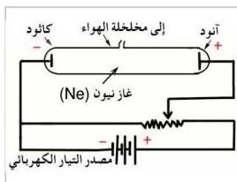

إن تأين الغازات وبالتالي قدرتها على التوصيل الكهربائي يُفسر بزيادة درجة الحرارة، فذرات أو جزيئات الغاز الساخنة تتحرك أسرع عند ارتفاع درجة حرارتها، وعند ذلك فإن عدداً من الجزيئات أو الذرات تبدأ بالحركة السريعة بشكل يجعل قسماً منها يتحلل إلى الكترونات وأيونات موجبة عند تصادمها مع الذرات أو الجزيئات الأخرى ويصبح الغاز بذلك موصلاً للكهرباء لوجود حاملات الشحنة (الإلكترونات والأيونات).

### التوصيل الكهربائي في الغازات Electric Conduction in Gases

عند دراسة التوصيل الكهربائي في الغازات تحت ضغط منخفضة ومختلفة، نحتاج إلى أنبوبة زجاجية ذات قطبين معدنيين عند طرفيها يسمى أحدهما الأنود (المصعد) Anode وهو القطب الموجب والآخر يسمى الكاثود (المهبط) Cathode وهو القطب السالب، فعند تطبيق فرق جهد عال حوالي ( ١٠ × ٥ فولت ) بين طرفي الأنبوبة (بين قطبي الأنبوبة) وعندما يكون ضغط الغاز الذي فيها منخفضاً، فإن الغاز يصبح موصلاً للتيار الكهربائي، ويأخذ شكل ضياء متوهج يملأ الأنبوبة وقد يختفي، وذلك يعتمد على ضغط الغاز داخل الأنبوبة. أنظر الشكل (٢).

شكل (٢)

في عام (١٨٠٨م) اكتشف العالم الألماني بلوكر بأنه عند ضغط منخفض مقداره ( ١٠ × ١,٣ ) ضغط جوي ( أي ( ١٠ × ١,٣ ) بار ) أي حوالي ( ٠,١ ملم زئبق ) تحدث ظاهرة جديدة في الأنبوبة وهي أن المهبط ( الكاثود ) يبعث بأشعة غير مرئية تسرى خلال الأنبوبة ، وبالرغم من أن هذه الأشعة غير مرئية إلا أنه يستدل

على وجودها بظهور وميض يميل إلى الزرقة عند اصطدام هذه الأشعة بجدار الأنبوبة أو بالأنود الموجب، سميت هذه الأشعة في البداية بالأشعة المهبطية استناداً إلى مصدرها، وقد سميت فيما بعد بالإلكترونات.

ماذا سيحدث داخل الأنبوبة إذا استمرت زيادة فرق الجهد بين قطبي الأنبوبة أكثر مما وصلت إليه؟ الذي سيحدث أن الطاقة الحركية للإلكترونات تزداد إلى حد معين على حساب شغل قوة المجال الكهربائي الناتج عن فرق الجهد بين القطبين، فإذا

٨٧

http://www.e-learning-moe.edu.ye/