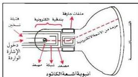
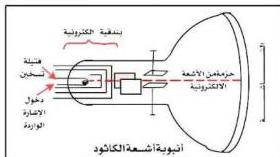

الموجبة لتكوين ذرات متعادلة مرة أخرى ونتيجة لهذا تشع ذرات الغاز الطاقة التي اكتسبتها عند تأييدها على شكل فوتونات (ضوء) وهذا هو سبب توهج أنبوبة التفريغ.

## أنبوبة أشعة الكاثود Cathode Rays Tube

شكل (٣)

الشكل (٣) يبين أنبوبة أشعة الكاثود والأجزاء التي تتكون منها ..
م تتركب أنبوبة أشعة الكاثود كما تشاهدها في هذا الشكل؟

- من أي جزء من الأنبوبة تنطلق الإلكترونات؟

- ما فائدة الملفات أو الألواح الحارفة؟

تتركب أنبوبة أشعة الكاثود من أنبوبة زجاجية مفرغة تماماً من الهواء، ويحتوي الطرف الضيق لها على بندقية إلكترونات (Electrons Gun)، كما في الشكل (٣)، ويُغطى طرفها

المتسع بمادة فلوريسية مثل كبريتيد الخارصين (ZnS)، وهذا الطرف هو شاشة أنبوبة أشعة الكاثود، وتقوم بندقية الإلكترونات بإرسال أشعة إلكترونية تسقط على الشاشة محدثةً نقطة مضيئة عليها.

وتحتوي أنبوبة أشعة الكاثود على مجموعة حارفة قرب منتصفها .. تتكون هذه المجموعة الحارفة إما من زوجين من الملفات التي تولد مجالين مغناطيسيين متعامدين، أو من زوجين من الألواح المعدنية التي تولد مجالين كهربائيين متعامدين.

عندما تطلق البندقية الإلكترونية الأشعة الإلكترونية (أشعة الكاثود) إلى الشاشة، ينتقل جزء من طاقة حركة الإلكترونات إلى المادة الفلوريسية التي على الشاشة، فتشع ضوءاً ذا لون معين يتوقف على نوع المادة الفلوريسية وعلى طاقة حركة الإلكترونات، فتظهر بذلك نقطة مضيئة لها لون معين، هذه النقطة تحدد موضع سقوط الأشعة الإلكترونية على الشاشة.

٨٩

http://www.e-learning-moe.edu.ye/