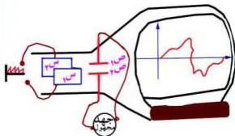

## طريقة عمل كاشف الذبذبات:

شكل (٥)

عند تشغيل جهاز كاشف الذبذبات، يوصل اللوحان (س₁، س₂) بمصدر تيار متردد يتغير جهده بصورة مشابهة لأسنان المنشأ (انظر الشكل ٥)، وهو عبارة عن دائرة صمام إلكتروني

خاص تسمى دائرة المسح. وتولد هذه

الدائرة جهداً متردداً بحيث يزداد تدريجياً حتى يصل إلى نهاية عظمى ثم ينعدم فجأة ويتكرر ذلك بتردد معين، ونتيجة لمثل هذا الجهد المتردد تتحرك النقطة المضيئة من اليسار إلى اليمين على الشاشة في خط مستقيم أفقي ثم تختفي لتظهر مرة أخرى على يسار الشاشة لتكرر الحركة السابقة.

وعند توصيل الجهد المتردد المراد دراسته باللوحين (ص₁، ص₂)، فإن النقطة المضيئة ترسم المنحنيات البيانية للجهد المتردد المراد دراسته. وتظهر هذه المنحنيات متحركة من اليسار إلى اليمين، وبتغيير تردد دائرة المسح فإننا نرى المنحنيات ساكنة على الشاشة عند تساوي أو تضاعف تردد الجهد المراد دراسته مع تردد جهد أسنان المنشأ، وتسكن المنحنيات لأن كل المنحنيات المعبرة عن الجهد المراد دراسته سوف تنطبق على منحنيات الجهد المعلوم، لاحظ الشكل (٥). ومعرفة تردد دائرة المسح يمكن لنا معرفة تردد الجهد المجهول المراد دراسته. كما أن شكل المنحنيات الناتجة تعطينا تصوراً لطبيعة الاهتزازات الكهربائية المسببة للجهد المجهول المراد دراسته، سواء كانت هذه الاهتزازات بسيطة أو مركبة.

وبما أن الجسيمات المهتزة هي الإلكترونات، وأن كتل الإلكترونات صغيرة جداً، فإن قصورها الذاتي صغير، لذلك تستطيع الإلكترونات أن تهتز بترددات عالية تقارب ترددات موجات اللاسلكي، كما أنها تستطيع أن تهتز بترددات منخفضة قد تصل إلى جزء من الهرتز.

٩١

http://www.e-learning-moe.edu.ye/