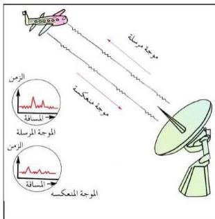
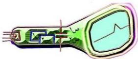

شكل (٦) محطة رادار

كي يمسح أوسع منطقة من الجو المحيط بالمحطة... فإذا صادفت هذه الموجات المرسلة جسمًا (مثلاً طائرة)، فإنها تصطدم به وتنعكس مرتدة إلى المحطة ليستقبلها المستقبل.

**المستقبل :** وهو عبارة عن هوائي (صحن) مشابه لهوائي المرسل، قابل للحركة في اتجاهات مختلفة، لاستقبال الموجات اللاسلكية المنعكسة، يقوم الهوائي (الصحن)

باستقبال هذه الموجات المنعكسة (الصدى) وتجميعها وتركيزها في بؤرة الهوائي حيث يوجد موصل معدني (ملف معدني) يحول الموجات اللاسلكية إلى تيارات كهربائية تأثيرية مترددة لها نفس تردد الموجات المستقبلية أو المرتدة، ثم يتم تكبيرها، بواسطة جهاز تكبير ثم ترسل إلى الكاشف.

**الكاشف :** عبارة عن أنبوبة أشعة الكاثود تسمى (كينوسكوب) (Kinescope) بها مجموعة حارفة للشعاع الإلكتروني وتتكون هذه المجموعة من زوجين من

شكل (٧) تركيب الكينوسكوب

الألواح المعدنية (س₁، س₂)، (ص₁، ص₂). ألواح أحد الزوجين وهما (س₁، س₂) موضوعان رأسياً فإذا تولد بينهما مجال كهربائي فإنه يكون أفقياً ويحرف الشعاع الإلكتروني في الاتجاه الأفقي، ولوحا الزوج الآخر

(ص₁، ص₂) موضوعان بشكل أفقي فإذا تولد بينهما مجال كهربائي فإنه يكون رأسياً ويحرف الشعاع الإلكتروني في الاتجاه الرأسي انظر الشكل (٧).

٩٣

http://www.e-learning-moe.edu.ye/