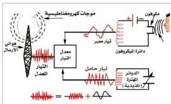

# مراحل عملية بث الموجات اللاسلكية (الموجات الراديوية) (عملية الإرسال الإذاعي):

- يوجه صوت المتكلم (أو غيره من الأصوات) إلى الميكروفون المتصل بمصدر كهربائي لتيار مستمر، فيهتز غشاء الميكروفون وتتغير تبعاً لذلك شدة التيار المستمر المار زيادة ونقصاً وفقاً للموجات الصوتية التي تصل إلى الميكروفون، ويصبح هذا التيار معبراً عن الصوت.

شكل (٨)

- تقوم الدائرة المهتزة (المذبذبة) بتوليد تيارات كهربائية عالية التردد تسمى هذه (التيارات الحاملة).
- عندما يصل كل من التيارات المعبرة عن الصوت والتيارات عالية التردد (التيارات الحاملة)

إلى معدل التيار، كما يبدو في الشكل (٨)، تدمج التيارات المعبرة عن الصوت في التيارات الحاملة عالية التردد (المذبذب)، فتغير من سعتها وينتج عن ذلك تيارات تسمى تيارات معدلة.

أي إن: تيار معبر عن الصوت + تيار حامل = تيار معدل.

- يتم بعد ذلك حث التيارات المعدلة إلى هوائي الإرسال الذي يقوم ببثها إلى الهواء الجوي في جميع الاتجاهات على شكل موجات كهرومغناطيسية.

# ثانياً: استقبال الموجات اللاسلكية (الاستقبال الإذاعي) Radio Waves Reception

تحتاج عملية الاستقبال الإذاعي إلى جهاز استقبال (جهاز راديو)، فماذا يقصد بعملية الاستقبال الإذاعي؟ ومُتركب جهاز الاستقبال الإذاعي؟ وكيف تتم عملية الاستقبال؟ لكي تتعرف على ذلك نفذ الآتي:

- قم بزيارة إلى أقرب ورشة متخصصة لصيانة الأجهزة الإلكترونية في منطقتك.
- قابل المهندس المتخصص، وأطلب منه أن يوضح لك الأجزاء الرئيسية التي يتركب منها جهاز الاستقبال الإذاعي (جهاز الراديو)، وأطلب منه أيضاً أن يوضح ذلك برسم تخطيطي مبسط.

٩٦

http://www.e-learning-moe.edu.ye/