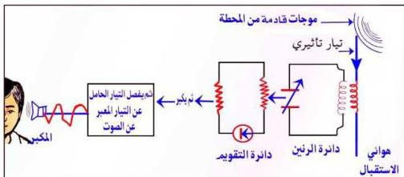

- اطلب منه كذلك أن يشرح لك - باختصار - عملية الاستقبال الإذاعي (أي استقبال الأصوات الصادرة من محطة الإذاعة) بواسطة جهاز الراديو، وكذلك المراحل التي تمر بها هذه العملية حتى تسمع تلك الأصوات.
إن عملية الاستقبال الإذاعي: هي عملية استلام الموجات اللاسلكية (الراديوية) من قبل جهاز الاستقبال (جهاز الراديو) وتحويلها إلى تيارات كهربائية تأثيرية ومن ثم إلى موجات صوتية سمعية لها تردد وخصائص الصوت الموجه إلى الميكروفون.

### تركيب جهاز الاستقبال الإذاعي (جهاز الراديو): Radio Structure

يتركب جهاز الراديو من الدوائر الرئيسية الآتية:

- دائرة الهوائي Antenna Circuit
- دائرة الرنين (ضبط الموجه) Tunning Circuit
- دائرة السماعة Audio Circuit

عملية استقبال الموجات اللاسلكية الراديوية (عملية الاستقبال الإذاعي):

إن عملية الاستقبال الإذاعي (أي عملية استقبال الأصوات من محطة الإذاعة بواسطة جهاز الاستقبال الراديو) تتلخص في النقاط الآتية:

- عندما تصل الموجات اللاسلكية (الكهرومغناطيسية) التي تبثها المحطة إلى هوائي جهاز الاستقبال (Antenna)، فإن الهوائي يقوم بتحويلها إلى تيارات كهربائية تأثيرية مختلفة التردد.

شكل (٩): عملية استقبال الموجات اللاسلكية الراديوية

٩٧

http://www.e-learning-moe.edu.ye/