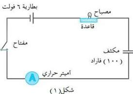
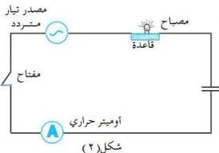

e-learning

# التحقق من أن التيار الكهربائي المتردد يمر في الدوائر الكهربائية التي تحتوي على مكثف بينما التيار المستمر لا يمر

# التجربة الثانية

# الأهداف

- تتحقق من مرور التيار الكهربائي المتردد في الدوائر الكهربائية التي تحتوي على مكثف كهربائي.
- تتحقق من أن التيار الكهربائي المستمر لا يمر في الدوائر الكهربائية التي تحتوي على مكثف كهربائي.

متردد باستخدام محوّل خافض للجهد، لتحصل على ٦ فولت كما يوضّحه الشكل (٢).
٤- أقفل الدائرة بواسطة المفتاح.
- لاحظ ما يحدث.
- ماذا تستنتج؟

# الأدوات والمواد المطلوبة

تحتاج لتنفيذ هذه التجربة إلى الأدوات الآتية:
- مكثف كهربائي ذو سعة محدّدة ولتكن ١٠٠ ميكروفاراد.
- مصباح كهربائي صغير يشتغل على جهد ٣ فولت.
- بطارية قوّتها الدافعة حوالي ٦ فولت.
- أميتر حراري.
- مفتاح كهربائي.
- قاعدة مصباح.

# خطوات تنفيذ التجربة

١- صل الأدوات السابقة معاً على التوالي كما يوضّحها الشكل (١).
٢- أقفل الدائرة الكهربائية بواسطة المفتاح.
- لاحظ ما يحدث.
٣- استبدل البطارية السابقة بمصدر تيار

٨

http://www.e-learning-moe.edu.ye/