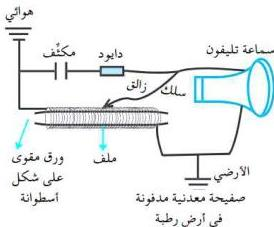

# التطبيق العملي على دائرة الرنين

# التجربة الثالثة

# الأهداف

١- تصمّم نموذجاً لجهاز التقاط بعض ترددات المحطات الإذاعية المحلية .
٢- تطوّر مهاراتك في استخدام بعض الأجهزة البسيطة .

# الأدوات والمواد المطلوبة

تحتاج لتنفيذ هذه التجربة إلى الأدوات الآتية :

- سلك نحاسي مستخدم في لف المحركات قطره (٣م²).
- ورق مقوّى لعمل أسطوانة ورقية .
- مكثّف سعته الكهربائية ما بين (١٠٠ - ٤٧٠) ميكروفاراد .
- دايود، سماعة تلفون، أسلاك توصيل .

# خطوات تنفيذ التجربة

١- ركّب الأدوات والمواد كما يوضّحه الشكل .
٢- حرّك الزالق يميناً ويساراً على الملف .
٣- ضع السماعة قريبة من أذنك حتى تسمع صوت لإحدى المحطات المحلية وفي هذه الحالة يمكن للدائرة التقاط تردّد المحطة الإذاعية .
- في أية حالة يتمّ للدائرة الرنينية التقاط تردّد أية محطة إذاعية ؟

- كيف يمكنك أن تحسب تردّد الرنين للدائرة السابقة ؟
- هل ستكون قيمة شدة التيار الكهربائي في هذه الحالة كبيرة أم صغيرة ؟ لماذا ؟
- إذا كان الحث الذاتي للملف ٧ هنري وسعة المكثّف $$\frac{7}{484} \times 10^{-4}$$ فاراد وتردّد التيار المار في الدائرة ٥٠ هيرتز، وأكبر قيمة لشدة التيار المار في الدائرة في حالة حدوث الرنين ٠,٥ أمبير ؛ احسب القيمة العظمى لفرق الجهد في الدائرة . إذا كانت مقاومة أسلاك الدائرة ١٦ أوم ؟

١٠

http://www.e-learning-moe.edu.ye/