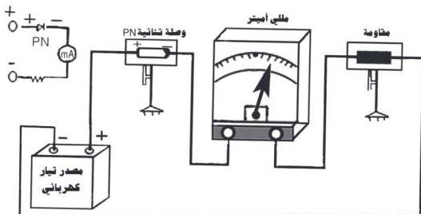

# الانحياز الأمامي للوصلة الثنائية PN

# التجربة الرابعة

# الهدف

- توصّل الوصلة الثنائية توصيلاً أمامياً في دائرة كهربائية مبسطة.

# الأدوات والمواد المطلوبة

تحتاج لتنفيذ هذه التجربة الأدوات والمواد الآتية :
- وصلة ثنائية (PN) .
- مصدر جهد كهربائي مستمر قوّته الدافعة (١٢ فولت) .
- مللي أميتر (أو جلفانومتر حسّاس)
- لقياس التيار الكهربائي الضعيف .
- مقاومة ثابتة مقدارها في حدود ١٠٠٠ أوم (١ كيلو أوم) .
- حاملات .
- أسلاك توصيل .

الشكل (١)

١٢

http://www.e-learning-moe.edu.ye/