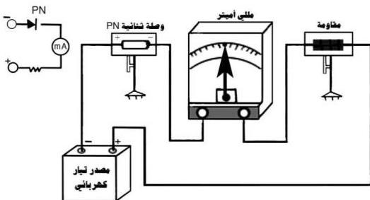

## خطوات تنفيذ التجربة

١- صل الأدوات المستخدمة كما هو
موضَّح في الشكل (١) بحيث
يوصل القطب الموجب للبطارية
بالبلورة الموجبة للوصلة الثنائية،
ويوصل القطب السالب للبطارية
بأحد طرفي المقاومة ويوصل الطرف
الآخر للمقاومة بالملي أميتر (أو
بالجلفانومتر) ومن الملي أميتر إلى
البلورة السالبة للوصلة الثنائية.
٢- لاحظ الملي أميتر (أو الجلفانومتر)
- هل يمرّ تيار كهربائي في هذه
dائرة؟ أم أنه لا يمرّ.
٣- عيّن قراءة الملي أميتر - وبالتالي

مقدار شدة التيار.

٤- اعكس توصيل قطبي البطارية
( مصدر التيار المستمر) كما في
الشكل (٢) ، بحيث يُوصَّل
القطب السالب للبطارية بالبلورة
الموجبة للوصلة الثنائية والقطب
الموجب للبطارية بأحد طرفي المقاومة
ومن الطرف الآخر للمقاومة إلى
الملي أميتر ومنه إلى القطب السالب
للوصلة الثنائية.
٥- لاحظ الملي أميتر. هل يمرّ تياراً
كهربائياً. أم أنه لا يمرّ؟
- ماذا نستنتج ؟

الشكل (٢)

١٣

http://www.e-learning-moe.edu.ye/