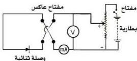

رسم المنحنى المميّز لوصلة ثنائية PN

التجربة الخامسة

# الهدف

– ترسم المنحنى المميّز لوصلة ثنائية من خلال التجربة العملية .

# الأدوات والمواد المطلوبة

تحتاج لتنفيذ هذه التجربة
الأدوات والمواد الآتية :
– بطارية ٦ فولت .
– ريوستات ( ٢٠٠ – ٣٠٠ أوم ) .
– مفتاح عاكس .
– فولتميتر ١٠ فولت .
– مللي أميتر .
– ميكرو أميتر .
– أسلاك توصيل .
– وصلة ثنائية .

# خطوات تنفيذ التجربة

١- كوّن دائرة كهربائية كما تلاحظها في الشكل أدناه .

٢- أقفل الدائرة الكهربائية مع مراعاة استخدام الوصلة الثنائية في حالة التوصيل الأمامي، وعندئذٍ إبدأ في زيادة فرق الجهد تدريجياً، وفي كل مرة غيّر فرق الجهد مع تعيين قيمته بواسطة الفولتميتر .
٣- عيّن شدة التيار بواسطة المللي أميتر ودوّن النتائج في جدول كالآتي :

|   |  |  |  | فرق الجهد ( ج ) ( فولت )  |
| --- | --- | --- | --- | --- |
|   |  |  |  | شدة التيار ( ت ) ( مللي أمبير )  |

٣- اعكس اتجاه التيار الكهربائي في دائرة الوصلة الثنائية ليصبح التوصيل خلفي ( عكسي )، ومنه استبدل المللي أميتر بالميكرو أميتر .
٤- غيّر فرق الجهد عدة مرات وفي كل مرة سجّل قيمته وقيمة شدة التيار المناظر، وبعد ذلك دوّن النتائج في الجدول كالآتي :

١٥

http://www.e-learning-moe.edu.ye/