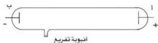

e-learning

# التفريغ الكهربائي خلال الغازات
( Electrical Discharge Through Gases )

# التجربة السادسة

# الأهداف

١- تجري تجربة لإنتاج أشعة المهبط ( أشعة الكاثود ).
٢- تصف الظروف التي يحدث عندها التفريغ الكهربائي خلال الغازات .

# الأدوات والمواد المطلوبة

تحتاج لتنفيذ هذه التجربة الأدوات والمواد الآتية :

- أنبوبة زجاجية طولها في حدود ( ١٥٠ سم ) وقطرها في حدود ( ٤ سم ) ، ( يوجد عند كل طرف من طرفيها قرص معدني يسميان قطبا الأنبوبة ) . أحدهما يُسمَّى المصعد ( الأنود ) ( أ ) والآخر يُسمَّى المهبط ( الكاثود ) ( ب ) .
- توجد في الأنبوبة فتحة جانبية توصل بمضخة تفريغ ( أو مخلخلة هواء ) ( Vacuum Pump ) انظر إلى الشكل .
- مخلخلة هواء ، أو مضخة تفريغ .
- محول كهربائي خافض للجهد ( يحول من ٢٢٠ إلى ٦ ، أو ٩ ، أو ١٢ فولت ) .

- ملف رومكورف .
- مقوم للتيار المتردد .

# خطوات تنفيذ التجربة

١- صل المحوّل الكهربائي الخافض للجهد بالمصدر الكهربائي المتردد الموجود في المعمل .
٢- صل مقوّم التيار الكهربائي بالمحوّل الكهربائي لتقويم التيار ( أو لتقويم الجهد )
٣- صل طرفي مقوّم الجهد بملفي ملف رومكورف ، وذلك للحصول على فرق جهد عال بين طرفي ساقي النحاس لملف رومكورف .

١٨

http://www.e-learning-moe.edu.ye/