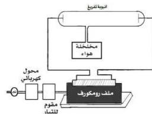

٤- صل طرفي ساقي النحاس بطرفي أو بقطبي أنبوبة التفريغ ، وبالتالي تحصل على فرق جهد عالٍ بين طرفي الأنبوبة .

– لاحظ أثناء ذلك داخل أنبوبة التفريغ .

– هل تلاحظ شرر كهربائي داخل الأنبوبة بين المهبط ( ب ) والمصعد ( أ ) ؟

– علام يدل ذلك ؟

٥- صل مخلخلة الهواء بالفتحة الجانبية لأنبوبة التفريغ ، وخلخل هواء الأنبوبة .

– لاحظ ما يحدث للمظاهر الضوئية داخلها .

# الاستنتاج

١٩

http://www.e-learning-moe.edu.ye/