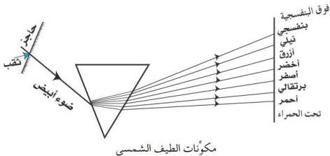

# الطيف الشمسي المرئي

# التجربة السابعة

# الهدف

١- تتعرّف على مكوّنات الطيف الشمسي المرئي .

# الأدوات والمواد المطلوبة

تحتاج لتنفيذ هذه التجربة الأدوات والمواد الآتية :
- منشور من الزجاج ، أو الكوارتز .
- حاجز مثقوب من منتصفه .
- حائل ( شاشة عرض أو جدار أبيض نظيف ) .

# خطوات تنفيذ التجربة

١- استقبل حزمة رفيعة من أشعة الشمس على حاجز أبيض كبير به ثقب ضيق .

- ماذا تشاهد على الحائل ؟
- بماذا تفسر ذلك ؟
٢- ضع منشوراً من الزجاج ، أو الكوارتز ، بحيث تسقط حزمة الأشعة على أحد جوانبه .
- ماذا تشاهد على الحائل ؟
- كم عدد الألوان التي تشاهدها ؟
- ما تفسيرك لذلك ؟
- ماذا تلاحظ ؟
- ماذا تستنتج ؟

٢١

http://www.e-learning-moe.edu.ye/