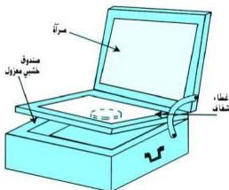

# جمع واستغلال الطاقة الشمسية

# التجربة الثامنة

# الأهداف

١- توضِّح كيف تجمع الطاقة الشمسية، وكيف يتمُّ خزنها.
٢- تتعرَّف على بعض طرق استغلال الطاقة الشمسية مثل التدفئة.

# الأدوات والمواد المطلوبة

تحتاج لتنفيذ هذه التجربة الأدوات والمواد الآتية :
- صندوق صغير من الخشب ، بحيث يكون له غطاءان أحدهما من الزجاج الشفاف، والآخر به مرآة مستوية، كما في الشكل .

# خطوات تنفيذ التجربة

١- ضع في الصندوق كمية من الماء .
٢- اغمس في الصندوق مقياس حرارة ( ثرمومتر ) .
٣- اجعل الصندوق مفتوحاً طول النهار

ومعرضاً لأشعة الشمس المباشرة .

- لاحظ قراءة الثرمومتر ، من وقت لآخر ، موضِّحاً سبب اختلاف القراءات .
- ماذا تلاحظ ؟
- ماذا تستنتج ؟

خرن الطاقة الشمسية

# الاستنتاج

٢٣

http://www.e-learning-moe.edu.ye/