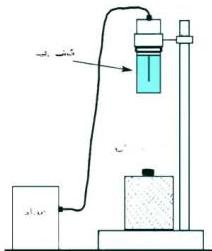

# المنحنى المميز لكشاف جيجر

# التجربة التاسعة

# الأهداف

١- تُعَيِّن بالتجربة العملية المنحنى المميِّز لكشاف جيجر .
٢- ترسم عملياً المنحنى المميِّز لكشاف جيجر

# الأدوات والمواد المطلوبة

تحتاج لتنفيذ هذه التجربة الأدوات والمواد الآتية :
- كشاف جيجر مثبت على حامل خاص به .
- دائرة عد (عداد) .
- مصدر فرق جهد كهربائي (٢٥٠-٥٠٠ فولت) .
- مصدر مشع تخرج منه إشعاعات بيتا
- ماسك يستخدم في تداول المصدر المشع أثناء التجربة كما في الشكل (١) .

# خطوات تنفيذ التجربة

١- صل كشاف جيجر بالمصدر الكهربائي وبالعداد .
٢- اترك الأجهزة تعمل لمدة خمس دقائق قبل البدء في القياس حتى تتلافى تأثير الحرارة .
٣- تأكَّد من سلامة الأجهزة قبل البدء في العمل وذلك بتشغيل العداد

لكي تقيس تردُّد المصدر العام للكهرباء بالمعمل (أو بالغرفة التي تجري فيها التجربة ، ٥٠ ذبذبة في الثانية مثلاً) .

٤- باستخدام الماسك ضع المصدر المشع على بعد (١٠ سم) من الكشاف .
٥- ضع المصدر الكهربائي بحيث يغذي الكشاف بأقل قيمة لفرق الجهد (٢٥٠ فولت) .

شكل (١) يوضِّح كشاف جيجر

٢٥

http://www.e-learning-moe.edu.ye/