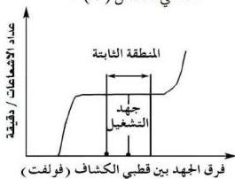

٦- سجّل عدد الإشعاعات بواسطة

العداد خلال فترة زمنية مناسبة (حوالي ٤-٥ دقائق).

٧- ارفع قيمة فرق الجهد في خطوات

ثابتة وفي كل مرة سجّل عدد

الإشعاعات بالعداد (خلال الفترة

الزمنية نفسها) كما في بند (٦)

حتى تصل بفرق الجهد إلى

(٤٠٠ - ٤٥٠ فولت).

٨- يجب أن يكون العداد والمصدر المشع

ثابتين في موضعهما طيلة فترة هذه

القياسات.

٩- يجب وقف التجربة عند بدء ارتفاع

عدد الإشعاعات المسجّلة بالعداد

بعد فترة ثبوتها. حتى

لا يتلف الكشاف.

١٠- رتّب النتائج في جدول كالآتي:

١١- ارسم العلاقة البيانية بين العدد

المسجّل في الدقيقة على المحور

الصادي وفرق الجهد بين قطبي

الكشاف (بالفولت) على

المحور السيني.

١٢- عيّن من الرسم المنطقة التي تثبت

فيها قيمة عدد الإشعاعات المسجّلة

١٣- عيّن فرق الجهد المقابل لنقطة

المنتصف في المنطقة الثابتة فيكون

هو جهد التشغيل الخاص بالكشاف

كما في الشكل (٢).

شكل (٢)

|   |  |  |  | فرق الجهد (بالفولت)  |
| --- | --- | --- | --- | --- |
|   |  |  |  | عدد الإشعاعات المسجّلة (إشعاع في الدقيقة)  |

٢٦

http://www.e-learning-moe.edu.ye/