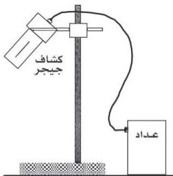

e-learning

# استخدام كشاف جيجر لقياس النشاط الإشعاعي والكشف عن نوعه

# التجربة العاشرة

# الأهداف

١- تستخدم كشاف جيجر لقياس النشاط الإشعاعي والكشف عنه .
٢- تقيس كمية هذا الإشعاع .
٣- تميز بين الأنواع المختلفة للإشعاعات المنبعثة .

# خطوات تنفيذ التجربة

أولاً: قياس النشاط الإشعاعي وتعيين كميته :

١- صل الكشاف بالعداد ، وبمصدر الجهد الكهربائي .
٢- اترك الأجهزة تعمل لمدة من الزمن (١٠ دقائق) حتى تتلافى تأثير التسخين ، والحرارة .

# الأدوات والمواد المطلوبة

تحتاج لتنفيذ هذه التجربة الأدوات والمواد الآتية :

- كشاف جيجر مثبت على حامل خاص به .
- دائرة عد (عداد) .
- مصدر فرق جهد كهربائي .
- ثلاثة مصادر مشعة الأول يشع أشعة ألفا والثاني بيتا والثالث جاما .
- ماسك لتداول المصادر المشعة .
- رقائق مختلفة السمك من الألومنيوم والرصاص .
- قاعدة يوضع عليها المصدر المشع .
- أرفف يثبت عليها الألواح المختلفة من الورق ، أو الألومنيوم ، أو الرصاص . كما في الشكل .

٢٨

http://www.e-learning-moe.edu.ye/