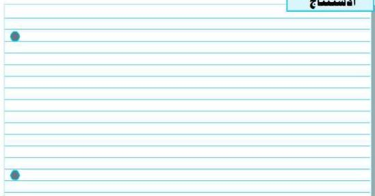

في لوح الورق وهذا يدل على عدم
قدرة أشعة ألفا على النفاذ ،
والاختراق خلال المواد .

٥- استبدل مصدر ألفا المشع بالمصدر
الثاني الذي يشع أشعة بيتا .

٦- ضع هذا المصدر على نفس المسافة .
- سجّل عدد أشعة بيتا التي
تصل الكشاف في فترة زمنية معينة
(٤-٥ دقائق) .

٧- ضع لوحاً رقيقاً من الورق بين المصدر
والكشاف .

- لاحظ أن تأثيره في تقليل عدد
الإشعاعات التي تخترقه ليس كبيراً
مثل تأثيره في حالة إشعاعات ألفا .

٨- استبدل اللوح الورقي بألواح مختلفة
السمك من مادة الألومنيوم .

- لاحظ أنه كلما زاد السمك قلّت
الإشعاعات التي تخترقه بنسبة
كبيرة؛ حيث تُمتصّ في ألواح
الألومنيوم من ذلك .

- يُستنتج من ذلك أن أشعة بيتا لها
قدرة على النفاذ خلال المواد أكبر
من تلك التي تتميز بها أشعة ألفا .

٦- استبدل مصدر بيتا المشع بالمصدر
الثالث الذي تنبعث منه أشعة جاما .

- لاحظ عدم فاعلية الألومنيوم في
امتصاص أشعة جاما .

٧- استبدل ألواح الألومنيوم بألواح من
الرصاص ذات سمك مختلف .

- لاحظ فاعليتها في تقليل نسبة
إشعاعات جاما التي تنفذ منها .

- ماذا تلاحظ ؟

- ماذا تستنتج ؟

# الاستنتاج

٣٠

http://www.e-learning-moe.edu.ye/