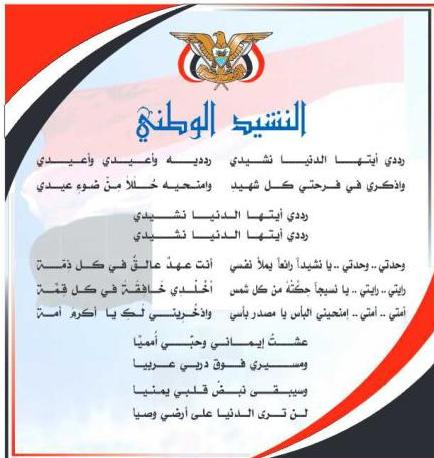

المصدر: قانون رقم (٣٦) لسنة ٢٠٠٦م بشأن السلام الجمهوري ونشيد الدولة الوطني للجمهورية اليمنية

### أعضاء اللجنة العليا للمناهج

أ.د. عبدالرزاق يحيى الأشول.

|  د. عبدالله عبده الحامدي. | أ/ علي حسين الحيمي.  |
| --- | --- |
|  د/ صالح ناصر الصوفي. | د/ أحمد علي المعمري.  |
|  أ.د/ محمد عبدالله الصوفي. | أ.د/ صالح عوض عرم.  |
|  أ/ عبدالكريم محمد الجنداري. | د/ إبراهيم محمد الحوثي.  |
|  د/ عبدالله علي أبو حورية. | د/ شكيب محمد باجرش.  |
|  د/ عبدالله لملس. | أ.د/ داوود عبدالمالك الحدابي.  |
|  أ/ منصور علي مقبل. | أ/ محمد هادي طواف.  |
|  أ/ أحمد عبدالله أحمد. | أ.د/ أنيس أحمد عبدالله طائع.  |
|  أ.د/ محمد سرحان سعيد المخلافي. | أ/ محمد عبدالله زبارة.  |
|  أ.د/ محمد حاتم المخلافي. | أ/ عبدالله علي إسماعيل.  |
|  د/ عبدالله سلطان الصلاحي. |   |

http://www.e-learning-moe.edu.ye/