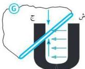

e-learning

# التيار الكهربائي المتردد

# التجربة الأولى

# الأهداف

١- تنفّذ تجربة تحصل من خلالها على تيار كهربائي متردّد .
٢- تثبت ظاهرة الحث الكهرومغناطيسي .

# الأدوات والمواد المطلوبة

تحتاج لتنفيذ هذه التجربة الأدوات والمواد الآتية :

- مغناطيس على شكل حدوة الفرس أو على شكل حرف (u) - سلك موصل للكهرباء - جلفانومتر حسّاسة - سلك سميك من النحاس .

مغناطيس على شكل حدوة الفرس لتوليد التيار الكهربائي

# خطوات تنفيذ التجربة

١- ضع المغناطيس على سطح منضدة خشبية .
٢- صل طرفي سلك النحاس السميك بالجلفانومتر الحسّاس بواسطة أسلاك توصيل كما يوضّحه الشكل .
٣- أمسك السلك بيدك وحرّكه للأعلى والأسفل بين قطبي المغناطيس بسرعة معيّنة، مع ملاحظة مؤشر الجلفانومتر

٤- أوقف حركة السلك بين قطبي المغناطيس .

- لاحظ ما يحدث لمؤشر الجلفانومتر الحسّاس .

- ماذا تستنتج من هذه التجربة .

٦

http://www.e-learning-moe.edu.ye/