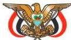

الجمهورية اليمنية

وزارة التربية والتعليم
قطاع المناهج والتوجيه
الإدارة العامة للمناهج

# الأدب والنصوص والنقد

## للصف الثالث الثانوي

### تأليف

د. أمة الرزاق علي حمد / رئيساً

د. أحمد قاسم الزمر
أ. خالد محمد ملهي
أ. محمد عبدالله محسن
أ. أحمد هادي جمال الدين
أ. ليلى عبد الخالق ناجي
أ. محمد مشى الخبيراني
أ. نصرة عبدالله الخضر

### فريق المراجعة:

أ. إسماعيل صالح الغياثي
أ. ليلى عبد الخالق ناجي
أ. محمد عبد الرحمن الكمالي
أ. محمد لطف صبار

تنسيق: أ/ فائز صالح منصور شاطر

تدقيق: د. صالح علي النهاري

### الإخراج الفني

الصف والتصميم: عادل عبده قاسم العفيفي
بسام أحمد محمد العامر
أحمد محمد علي العوامي

أشرف على التصميم: حامد عبدالعالم الشيباني

١٤٣٨هـ - ٢٠١٧م

http://www.e-learning-moe.edu.ye/