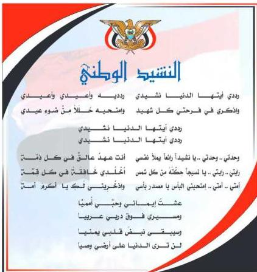

e-learning

المصدر: قانون رقم (٢٦) لسنة ٢٠٠٦م بشأن السلام الجمهوري وتشيد الدولة الوطني للجمهورية اليمنية

### أعضاء اللجنة العليا للمناهج

أ.د. عبدالرزاق يحيى الأشول.

- د/ عبدالله عبده الحامدي.
- د/ عبدالله سالم لمس.
- أ/ أحمد عبدالله أحمد.
- د/ فضل أحمد ناصر مطلي.
- د/ صالح ناصر الصوفي.
- د/ محمد عمر سالم باسليم.
- أ.د/ داوود عبدالمالك الحدابي.
- أ.د/ محمد حاتم الخلافي.
- أ.د/ محمد عبدالله الصوفي.
- د/ عبده أحمد علي النزيلي.
- أ/ محمد عبدالله زبارة.
- أ/ عبدالكريم محمد الجنداري.
- أ/ علي حسين الحيمي.
- د/ إشراف هائل عبدالجليل الحكيمي.
- أ/ محسن صالح حسين اليافعي.
- أ.د/ أحمد علي المعمري.
- أ.د/ محمد سرحان سعيد الخلافي.
- أ.د/ شكيب محمد باجرش.
- أ.د/ صالح عوض عرم.
- أ.د/ أنيس أحمد عبدالله طائع.
- أ.د/ إبراهيم محمد الحوشي.
- أ/ عبدالله علي إسماعيل الرازحي.

د. عبدالله سلطان الصلاحي.

http://www.e-learning-moe.edu.ye/