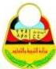

الجمهورية اليمنية

وزارة التربية والتعليم
قطاع المناهج والتوجيه
الإدارة العامة للمناهج

# القراءة

للصف الثالث الثانوي

المؤلفون

د. أمة الرزاق علي حُمَد / رئيساً

١- د/ عبدالله علي الكوري
٢- أ/ أحمد هادي جمال الدين
٣- أ/ أم الخير محمد الجعدي
٤- أ/ ليلى علي ناشر
٥- أ/ محمد يحيى محمد بلابل
٦- أ/ مصطفى محمد العلواني

فريق المراجعة:

أ. إسماعيل صالح الغياثي
أ. محمد عبد الرحمن الكمالي
أ. ليلى عبد الخالق ناجي
أ. محمد لطف صبار

تنسيق: أ/ فائز صالح منصور شاطر

تدقيق: د. صالح علي النهاري

الإخراج الفني

الصف والتصميم: عادل عبده قاسم العفيفي
بسام أحمد محمد العامر
أحمد محمد علي العوامي

أشرف على التصميم: حامد عبد العالم الشيباني

١٤٣٨هـ - ٢٠١٧م

http://www.e-learning-moe.edu.ye/