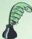

## *مكانة العلماء المسلمين في تاريخ العلم*

ماذا عسى أن تكون مكانة علماء الغرب في تاريخ العلم بالنسبة إلى مكانة علمائنا المسلمين ؟ وماذا عسى أن يكون الدور الذي لعبه هؤلاء مقارنة بالدور الذي قام به العلماء المسلمون في تاريخ الحضارة الإنسانية ؟ لا شك في أن علماءنا المسلمين يمثلون واسطة العقد .

لقد كان ديدنهم إذا فتحوا بلداً أن يبدؤوا بإنشاء مسجد وإقامة مدرسة، هذا غير ما ينشئونه في المدن الكبيرة من جامعات تحوي معامل ومختبرات ومراصد، ومكتبات حافلة . استعانوا أول الأمر بعلم من سبقوهم، تمثلوا العلم الإغريقي، والعلم الاسكندري، لم يكونوا مجرد نقلة، لكنهم زادوا على ما ترجموه من هذه العلوم، وأضافوا إليه الكثير، واستحدثوا فنوناً لم يمارسها سواهم، وسطعوا في سماء الحضارة الإنسانية، ورفعوا من شأنها، وأعلوا من بنيانها، وظلت مؤلفاتهم العمدة التي يعتمد عليها أهل الصناعة في أوروبا طيلة قرون وقرون، ولم يستغن التعليم في جامعات أوروبا عمّا نقلته إلى لغاتها من مؤلفات المسلمين . ألّفوا في الطب، والكيمياء، والرياضيات، والفلك، والطبيعة، والضوء، والمعادن، والميكانيكا . وقد قيل بحق إنه لولا أعمال العلماء المسلمين، لاضطر علماء النهضة الأوروبية أن يبدؤوا من حيث بدأ هؤلاء، ولتأخر سير المدينة عدة قرون . وليس في طاقة منصف أن ينكر، أو ينسى فضل المسلمين على العلم قديماً وحديثاً، وهل ننكر ، أو ننسى فضل كتبهم المهمة، ولاسيماً كتاب الحسن بن الهيثم في البصريات، إذ يرى القارئ فصولاً ممتعة في المرايا والصورة الظاهرة فيها، وانحراف الأشياء ومساحتها . كما يرى فيه حلاً هندسياً لبعض معادلات الدرجة الرابعة، وقد نقل هذا الكتاب إلى اللاتينية والإيطالية، واستعان به فطاحل العلماء في البصريات، وقال عنه أحدهم : « إنه مصدر معارفنا في البصريات » وعن علم الكيمياء يُعدّ جابر بن حيان من أشهر العلماء المسلمين فيه، وقد عاش في أواخر\* من كتاب 'قراءات في تاريخ العلم عند العرب' تأليف : حمد موراني ود. عبد الحليم منتصر 'بتصرف' .

٧٠

<http://www.e-learning-moe.edu.ye/>