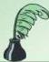

# احترام المرأة *

نعم إنَّ الرجال قوامون على النساء كما يقول الله تعالى في كتابه العزيز، ولكن المرأة عماد الرجل، وملاك أمره، وسرُّ حياته، من صرخة الوضع إلى أنة النزع.
لا يستطيع الأب أن يحمل بين جانحتيه لطفله الصغير عواطف الأم، فهي التي تحوطه بعنايتها ورعايتها، وتبسط عليه جناح رحمتها ورأفتها، وتسكب قلبها في قلبه حتى يستحيلا إلى قلب واحد، يخفق خفوقاً واحداً، ويشعر بشعور واحد، وهي التي تسهر عليه ليلها، وتكلؤه نهارها، وتحتمل جميع آلام الحياة وأرزاقها في سبيله، غير شاكية ولا متبرمة، بل تزداد شغفاً به، وإيثاراً له، وضناً بحياته بمقدار ما تبذل من الجهود في سبيل تربيته. ولو شئت أن أقول لقلت: إن سرَّ الحياة الإنسانية، وينبوع وجودها، وكوكبها الأعلى الذي تنبعث منه جميع أشعتها ينحصر في كلمة واحدة هي (قلب الأم).

ولا يستطيع الرجل أن يكون رجلاً حتى يجد إلى جانبه زوجة تبعث في نفسه روح الشجاعة والهمة، وتغرس في قلبه مسؤولية التبعة وعظمتها، وحسب المرء أن يعلم أن رعية كبيرة أو صغيرة تضع ثقتها فيه، وتستظل بظل حمايته ورعايته، وتعتمد في شؤون حياتها عليه. وما نصح الرجل بالجد في عمله، والاستقامة في شؤون حياته، وسلوك الجادة في سيره، ولا هداه إلى التدبير ومزاياه، والاقتصاد

* من كتاب (النظرات) لمصطفى لطفي المنفلوطي، الجزء الثالث (بتصرف).

٩٥

http://www.e-learning-moe.edu.ye/