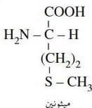
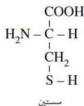
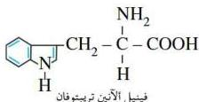
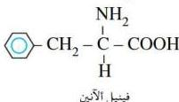

# ٤- الحموض الأمينية المحتوية على الكبريت :

وهي حموض يحتوي الجزيء منها على مجموعة أمينو واحدة ومجموعة كربوكسيل واحدة ومجموعة ثيول (-SH) أو كبريتيدية، ومن أمثلة هذه الحموض ما يأتي :

# ٥- المشتقات الأروماتية للحموض الأمينية :

وهي حموض تحتوي على حلقات أروماتية وحلقات دائرية مختلفة، ومن أمثلتها :

كما أن هناك حموضاً أمينية وعددها ثمانية لا يستطيع جسم الحيوان أو الإنسان بناءها، وعدم احتواء الغذاء عليها يؤدي إلى ضعف نمو الجسم ومرض سوء التغذية وغيرها من الأمراض، لذا يجب تناولها أثناء الوجبات الغذائية من مصادر خارجية، ولهذا تسمى هذه الحموض بالحموض الأمينية الأساسية، وهي :

|  ١ - حمض ليوسين | Leucine | ٢ - ميثونين | Methionine  |
| --- | --- | --- | --- |
|  ٣ - فينيل الأثين | Phenylalanine | ٤ - لايسين | Lysine  |
|  ٥ - قالين | Valine | ٦ - إيزوليوسين | Iso-Leucine  |
|  ٧ - ثريونين | Threonine | ٨ - تريبتوفان | Tryptophane  |

# الخواص الفيزيائية :

أغلب الحموض $\alpha$ - الأمينية مواد صلبة، بلورية، لها درجة انصهار عالية (أبسط هذه الحموض هو الجلايسين الذي تبلغ درجة انصهاره ٢٥٠م)، والأفراد الأولى البسيطة من هذه الحموض سريعة الذوبان في الماء، وقليلة الذوبان في المذيبات العضوية، ومتعادلة التأثير على ورقتي دوار الشمس.

١٠٠

http://www.e-learning-moe.edu.ye/