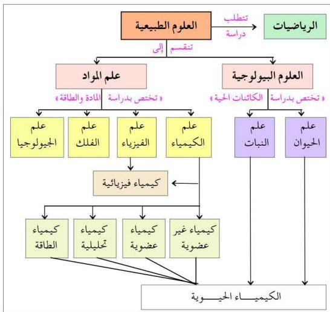

## مقدمة عن الكيمياء الحيوية

تتناول هذه الوحدة بعض المركبات الكيميائية التي تُعدُّ من المكونات الأساسية لغذاء الإنسان، والتي تشمل الكربوهيدرات والزيوت والبروتينات، والتي تمر بعدة تفاعلات كيميائية داخل جسم الإنسان في وجود الإنزيمات، فتكسر إلى مركبات صغيرة تدخل في بناء أنسجة الجسم أو تحرق تماماً لتعطي الطاقة التي تساعد على قيام الجسم بالوظائف الحيوية المختلفة.

ويسمَّى فرع الكيمياء الذي يهتم بدراسة هذه المركبات وتفاعلاتها داخل جسم الكائن الحي بالكيمياء الحيوية، كما هو موضَّح في الشكل (٦-١).

شكل (٦-١) علاقة الكيمياء الحيوية بالعلوم الأخرى

من خلال الشكل (٦-١)، وضَّح أهم الفروع التي ترتبط بالكيمياء الحيوية.

١٠٥

http://www.e-learning-moe.edu.ye/