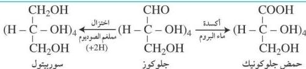

- انظر إلى الصيغة المفتوحة للجلوكوز والفركتوز، وحدد نوع المجموعة الوظيفية التي تميّز كلًّا منهما.
- انظر إلى الصيغة المغلقة للجلوكوز والفركتوز، وحدّد الاختلاف الذي يمكن من خلاله أن تميّز بين الجلوكوز والفركتوز الحلقي.

# ملاحظة

يُعدُّ الجلوكوز المصدر المهم للطاقة في جسم الكائن الحي، وصيغته $C_6H_{12}O_6$، وعندما اكتشف العلماء هذه الصيغة لأول مرة كان العلماء يميلون لكتابة الصيغة على النحو الآتي: $C_6(H_2O)_6$ معتقدين أن هناك رابطة كيميائية بين الكربون والماء، ولذلك وضعوا التسمية (كربو - هيدريت) لتدل على الماء المحتوي على رابطة بذرة الكربون. وعلى الرغم من أن العلماء يدركون حاليًّا أن جزيء الماء لا وجود له في المركبات الكربوهيدراتية إلا أن الاسم القديم لا زال هو الشائع.

# الخواص الفيزيائية:

السكريات الأحادية عبارة عن مواد بلورية حلوة المذاق وتذوب بسهولة في الماء لكنها لا تذوب في المذيبات العضوية.

# الخواص الكيميائية:

بما أن بعض السكريات الأحادية تحتوي على مجموعة ألدهيد مثل الجلوكوز فيمكن أن تسري عليها تفاعلات الأكسدة والاختزال، حيث يمكن أكسدة مجموعة الألدهيد إلى مجموعة كربوكسيل، كما يمكن اختزالها إلى كحول أولي، وذلك على النحو الآتي:

وبالنسبة للسكريات الأحادية التي تحتوي على مجموعة الكيتون مثل الفركتوز، فيمكن أكسدتها باستخدام العوامل المؤكسدة القوية مثل حمض فوق الأيوديك $HIO_4$ الذي يؤدي إلى كسر السلسلة الكربونية وتكوين حموض تحتوي على أعداد قليلة من ذرات الكربون، وذلك على النحو الآتي:

١٠٩

http://www.e-learning-moe.edu.ye/