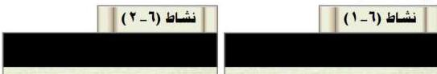
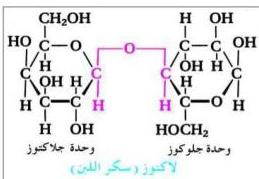

$$\begin{array}{c} \text{CH}_2\text{OH} \\ | \\ \text{C} = \text{O} \\ | \\ \text{HO} - \text{C} - \text{H} \\ | \\ (\text{H} - \text{C} - \text{OH})_2 \\ | \\ \text{CH}_2\text{OH} \end{array} \xrightarrow[4[\text{O}]]{\text{HIO}_4} \begin{array}{c} \text{CH}_2\text{OH} \\ | \\ \text{COOH} \end{array} + (\text{H} - \text{C} - \text{OH})_2 + \text{H}_2\text{O} + \text{HI} \\ \text{COOH} \\ \text{COOH} \\ \text{CH}_2\text{OH} \\ \text{مركتوز} \end{array}$$

نظراً لأن السكريات الأحادية تتأكسد في محاليلها بواسطة محلول فهلنج الذي يحتوي على أيون النحاس (II) في $\text{CuSO}_4$ ، لذلك يستخدم هذا التفاعل للكشف عن هذه السكريات.

## ٢ - السكريات المحدودة Oligosaccharides

كلمة Oligo تعني قليل، وهي تدل على أن هذا النوع من السكريات يتراوح عدد وحدات السكر فيها من ٢-١٠ وحدات من السكر الأحادي.

وسنقتصر في دراستنا على السكريات الثنائية Disaccharides ، وهذا النوع يتكون من وحدتين من السكر الأحادي، ومن أشهر السكريات الثنائية ما يأتي:

### أ - السكروز (سكر القصب) Sucrose

ويوجد في قصب السكر وفي البنجر، ويتكون من وحدة جلوكوز + وحدة فركتوز.

### ب - المالتوز (سكر الشعير) Maltose

ويوجد في بذور الشعير، ويتكون من وحدتي (جلوكوز + جلوكوز).

### ج- اللاكتوز (سكر اللبن) Lactose

شكل (٦-٣) الصيغة التركيبية لسكر اللبن

ويتكون من جلوكوز + جلاكتوز. وهو من أهم السكريات الحيوانية، ويوجد في لبن جميع الثدييات، ونسبته في حليب الأبقار ٥% تقريباً، وفي حليب الأم يتراوح بين ٥% إلى ٨%، ومن مميزاته أنه لا يتخمر بواسطة إنزيمات الخميرة مما

١١٠

<http://www.e-learning-moe.edu.ye/>