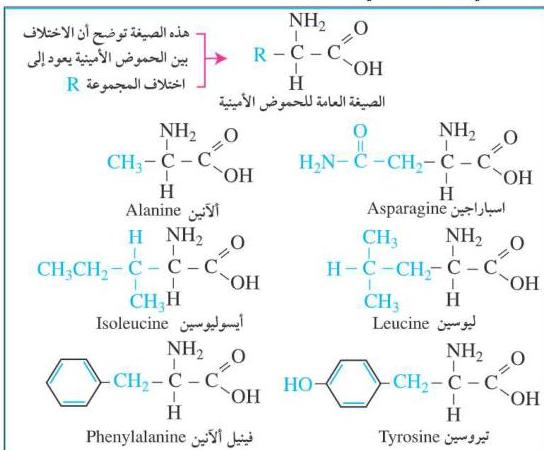

## تركيب البروتينات :

البروتينات عبارة عن مركبات عضوية تحتوي على سلاسل من ذرات الكربون والهيدروجين والنيتروجين والأكسجين، وأحياناً يوجد الكبريت والفسفور بنسب ضئيلة، ويمثل النيتروجين ١٦٪ من وزن البروتين.

## الحموض الأمينية :

تعتبر الحموض الأمينية الوحدة الأساسية لبناء البروتينات، وهناك عشرون نوعاً من الحموض الأمينية التي تدخل في تركيب كل البروتينات.

يستطيع جسم الإنسان أن ينتج (١٢) نوعاً من الحموض غير الأساسية، وهي مهمة جداً لأنها تعمل على تكوين بروتين الأنسجة، أما الثمانية أنواع الأخرى فإن الجسم لا يستطيع إنتاجها، ويحصل عليها من الغذاء المحتوي على البروتين، وتدعى هذه الحموض بالحموض الأمينية الأساسية، والتي تعدُّ ضرورية لنمو الإنسان، وتتواجد في البروتين الحيواني بنسب كبيرة.

شكل (٦-٤) يوضِّح بعض الحموض الأمينية

١١٣

http://www.e-learning-moe.edu.ye/