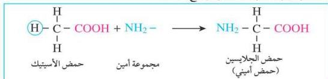
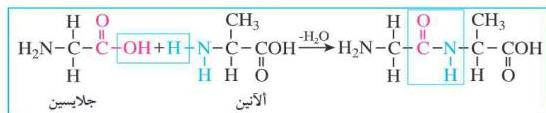

– من الشكل (٦-٤) استخرج الحموض الأمينية الأساسية وغير الأساسية؟

وتعتبر الحموض الأمينية من مشتقات الحموض العضوية، فأبسط أنواع الحموض الأمينية حمض الجلايسين، وهو مشتق من حمض الأسيتيك (الخليك) العضوي بعد إحلال مجموعة أمين (-NH) محل ذرة الهيدروجين الموجودة على ذرة الكربون الثانية (كربون الفا)، كما هو موضح أدناه.

وبالنظر إلى أبسط الحموض الأمينية نجد أن الحمض الأميني يحتوي على مجموعتين وظيفيتين هما: مجموعة الكربوكسيل -COOH التي تعطيه الخاصية الحمضية، ومجموعة الأمين -NH₂ وتعطيه الخاصية القاعدية، وهاتان المجموعتان تكسبان الحمض الأميني طبيعة مترددة، أي إنه يتفاعل مع الحموض كقاعدة ومع القواعد كحمض.

وعند تكاثف حمضين أمينيين مع بعضهما تتكون رابطة بين مجموعة الكربوكسيل لأحد الحموض الأمينية وبين مجموعة الأمين لحمض أميني آخر بعد فقد جزيئة ماء وتسمى هذه الرابطة بالرابطة الببتيدية.

■ مثال:

عند تكاثف حمض الجلايسين مع حمض الأنين لتكوين جلايسيل الأنين ثنائي الببتيد تتكون رابطة ببتيدية على النحو الآتي:

١١٤

http://www.e-learning-moe.edu.ye/