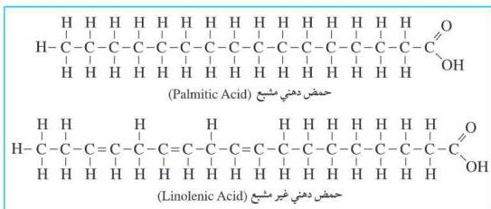
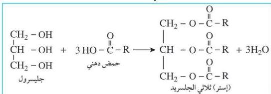

شكل (٦-٥) يوضّح الحموض الدهنية المشبعة وغير المشبعة

كما أن الليبيدات تتكوّن كما في المعادلة الآتية:

### الدهون والزيوت:

تعتبر الدهون والزيوت النباتية من أنواع الليبيدات البسيطة، وتتشابه الدهون والزيوت في التركيب الكيميائي وتختلف في نوعية الحموض العضوية المكونة لكل منهما، ويوضح الجدول (٦-١) أهم الخواص للزيوت والدهون.

|  الدهون | الزيوت  |
| --- | --- |
|  - – صلبة في درجة حرارة الغرفة. - – تحتوي على وفرة من حموض دهنية مشبعة أو حموض دهنية طويلة السلسلة (أكثر من ١٠ ذرات كربون). ومنها (سمن الأبقار، والسمن الصناعي المعلب، والجبن). | - – سائلة في درجة حرارة الغرفة. - – تحتوي على وفرة من الحموض الدهنية غير المشبعة أو حموض دهنية قصيرة. ومنها زيت الذرة وزيت الزيتون.  |

جدول (٦-١) أهم خواص الزيوت والدهون

١١٦

<http://www.e-learning-moe.edu.ye/>