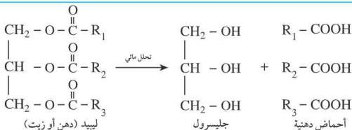

وهناك أنواع عديدة من الزيوت، يمكن تصنيفها على النحو الآتي:

١ - زيوت معدنية: وهي من مشتقات المنتجات البترولية مثل زيت البرافين وزيت الديزل.

٢ - زيوت متطايرة: وتستخرج من النباتات العطرية، مثل زيت القرنفل وزيت القرفة.

٣ - زيوت غير متطايرة (ثابتة): وقد تكون نباتية، مثل: زيت الذرة والقطن وزيت الزيتون، وقد تكون حيوانية مثل زيت كبد الحوت.

# الخواص الفيزيائية لليبيدات:

- لا تذوب في الماء ولكنها تذوب في المذيبات العضوية مثل البنزين والأيثر.
- درجات انصهارها منخفضة.

# تفاعلات الليبيدات:

هناك نوعان من التفاعلات الخاصة بالليبيدات هي:

١ - تفاعلات على روابط الإستر.

٢ - تفاعلات على الروابط المزدوجة في الحمض الدهني.

# ١) التفاعلات على رابطة الإستر:

# أ - التحلل المائي:

تتحلل الليبيدات (الدهون والزيوت) بفعل الإنزيمات الهاضمة أو الحموض القوية وينتج عنها حموض دهنية وجليسرول.

# ب - التصين:

تتحول الليبيدات (الدهون والزيوت) إلى صابون عند تفاعلاتها مع القواعد القوية مثل الصودا الكاوية. (وهذا التفاعل سيتم شرحه في الوحدة الثامنة من هذا الكتاب).

١١٧

http://www.e-learning-moe.edu.ye/