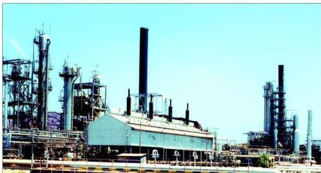

# الذهب الأسود
## The Black Gold

# الوحدة السابعة

# الأهداف

نتوقع منك بعد الانتهاء من دراسة هذه الوحدة أن تكون قادراً على أن:

١ - توضح المقصود بالذهب الأسود.
٢ - توضح خصائص المركبات الموجودة في خام البترول.
٣ - تذكر أهم العناصر التي تدخل في تركيب النفط.
٤ - تقارن بين النظريات التي حاولت تفسير أصل النفط وطريقة تكوينه.
٥ - تشرح أهم الطرق الحديثة المستخدمة للكشف عن النفط.
٦ - تفسر المبدأ الذي يتم على أساسه تكرير البترول في برج التقطير.
٧ - توضح أهم نواحٍ عملية تكرير البترول واستخداماتها.
٨ - تستنتج العلاقة بين عدد ذرات الكربون في جزئيات المركبات الموجودة في البترول ودرجة الغليان.
٩ - توضح بالمعادلات الكيميائية الموزونة أهم العمليات المستخدمة لزيادة إنتاج الجازولين.
١٠ - توضح بالأمثلة أهمية النفط كمصدر للطاقة وكمصدر للمنتجات الصناعية.

١٢٣

http://www.e-learning-moe.edu.ye/