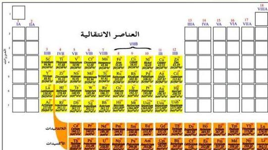

# العناصر الانتقالية
## Transition Elements

## الوحدة الأولى

### الأهداف

نتوقع منك بعد الانتهاء من دراسة هذه الوحدة أن تكون قادراً على أن:

1. تُحدَّد مواقع العناصر الانتقالية في الجدول الدوري.
2. تُبيِّن أوجه الشبه والاختلاف بين عناصر الفلزات الرئيسية والفلزات الانتقالية.
3. تُوضِّح المقصود بالعنصر الانتقالي.
4. تصنِّف عناصر الفئة (d) إلى السلسلات الانتقالية الأولى والثانية والثالثة.
5. تُبيِّن مواقع عناصر الفئة (f) من العناصر الانتقالية.
6. تُوضِّح أهم الخواص الفيزيائية والكيميائية للعناصر الانتقالية.
7. تذكِّر أهم استخدامات العناصر الانتقالية.
8. تُحدِّد موقع عنصر الحديد من بين العناصر الانتقالية.
9. تُوضِّح أهم خامات الحديد.
10. تشرح طريقة استخلاص الحديد من خاماته في الفرن اللافح.
11. تُوضِّح أهم الخواص الفيزيائية والكيميائية للحديد.
12. تجري تجارب الكشف العملية للكشف عن الحديد في أملاحه.

١١

http://www.e-learning-moe.edu.ye/