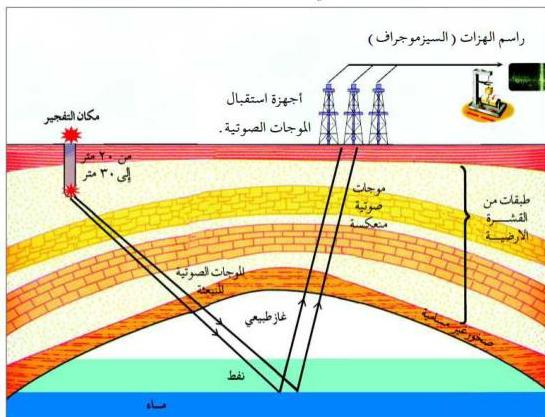

## ٢ - قياس المغناطيسية الأرضية:

اتضح من خلال الدراسات الاستكشافية أن النفط يوجد غالباً بالقرب من الصخور الملحية التي تتميز بأن لها مغناطيسية عكسية تعمل على إضعاف المغناطيسية الأرضية، لذلك يقوم العلماء حالياً باستخدام أجهزة قياس المغناطيسية والتحليق فوق المناطق المراد استكشافها، وتقاس المغناطيسية وتُدوّن المعلومات في خرائط تحدّد الأماكن التي لوحظ فيها انخفاض المغناطيسية حيث تكون دليلاً على وجود حقول النفط بالقرب من هذه المناطق.

## ٣ - قياس الاهتزازات الأرضية:

تُعدُّ هذه الطريقة من أكثر الطرق الحديثة استخداماً لاستكشاف النفط وتحديد أماكن وجوده تحت سطح الأرض. انظر الشكل (٧-٢) والذي يمثل رسماً توضيحياً لطريقة قياس الاهتزازات الأرضية التي تحدّد أماكن تواجد النفط.

شكل (٧-٢) طريقة قياس الاهتزازات الأرضية التي تحدّد أماكن وجود النفط تعتمد فكرة هذه الطريقة على إحداث هزة أرضية ضعيفة باستخدام المتفجرات على عمق (٢٠-٣٠م)، ثم استقبال الموجات الصوتية التي تنعكس من باطن الأرض

١٢٩

http://www.e-learning-moe.edu.ye/