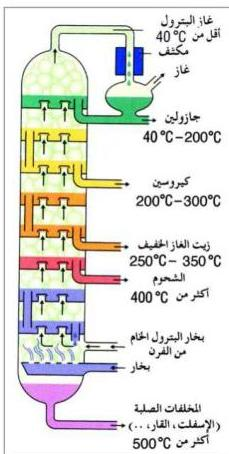

نشاط (٧-٣)

اجمع بعض المراجع عن استخراج النفط في اليمن والعالم العربي، واكتب تقريراً عن أماكن استخراجه وكمية الإنتاج اليومي لكل بلد، والتقديرات الحالية لكل مخزون، ثم ناقش ذلك مع زملائك ومدرسك.

شكل (٧-٣) مواد منتجة في برج التقطير

**تكريم النفط Petroleum Refining**

مما سبق هل يمكن استخدام النفط الخام بشكل مباشر بعد استخراجه من آبار النفط، ولماذا؟ يحتوي النفط الخام على خليط من المركبات الهيدروكربونات المشبعة والحلقية والأروماتية والتي قد تتراوح عدد ذرات الكربون في جزئياتها من ذرة واحدة، كما في الميثان CH₄ إلى ٣٠ ذرة؛ ونتيجة لذلك فإن مكونات النفط الخام تختلف في درجة غليانها تبعاً لزيادة الوزن الجزيئي لهذه المركبات فيها، مما يجعل عملية فصلها ممكناً عن طريق عملية التقطير التجزيئي والذي يتم باستخدام برج التقطير، كما هو موضح في الشكل (٧-٣).

ويتكون برج التقطير التجزيئي من اسطوانة معدنية يصل طولها إلى حوالي ٣٠ متراً، ويتراوح قطرها بين (٣ إلى ٥ أمتار). وتتألف هذه الأسطوانة من عدة غرف يفصلها عن بعضها إناء معدني يحتوي على عدد من الصمامات، ويوجد أسفل كل غرفة فتحة موصلة بأنبوب وذلك لنقل المادة المقطرة إلى خارج البرج.

ويتم عملياً دفع النفط الخام إلى أنابيب متعرجة داخل فرن كبير للتسخين تصل درجة حرارته إلى حوالي ٥٠٠م تقريباً. ونتيجة لهذه الحرارة الشديدة تتبخر مكونات النفط إلى برج التقطير فتتخفض درجة حرارتها فتتكثف المواد ذات الوزن الجزيئي الكبير أولاً، وتندفع باقي الأبخرة إلى أعلى عبر الصمامات فيحدث تكثف للمواد

١٣١

http://www.e-learning-moe.edu.ye/