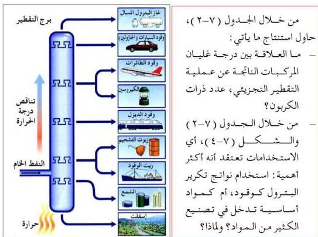

شكل (٧-٤) استخدامات النفط

# ملاحظة

الجازولين والكيروسين من أهم نواتج عمليات التقطير التجزيئي إلا إنهما يحتويان على بعض الشوائب من الكبريت ومركباته والتي تحد من فعاليتها كوقود، وتعمل على تآكل أجزاء الحركات التي تدور بواسطة حرق وقود الجازولين أو الكيروسين، ولذلك يتم تنقية هاتين المادتين بخلطهما بحمض الكبريتيك المركز، ثم يخض المزيج جيداً ويغسل بعد ذلك بالماء، وبحلول NaOH للتخلص من آثار حموض الكبريت.

# زيادة إنتاج الجازولين:

نظراً للتطور الجاري في وسائل المواصلات مثل السيارات والطائرات؛ تزايد الطلب على مادة الجازولين المستخدمة كوقود، ونظراً لأن عملية التقطير التجزيئي المباشرة لا تعطي سوى ٢٠٪ من النواتج كجازولين، لذلك جرى في السنوات الأخيرة من القرن الماضي تطوير طرق جديدة تم بواسطتها الحصول على المزيد من الجازولين عن طريق تكسير الجزيئات الكبيرة إلى جازولين، وذلك باستخدام الطرق الآتية:

١٣٣

http://www.e-learning-moe.edu.ye/