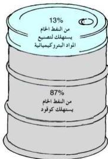

- راجع الجدول (٢-٧)، وحدّد أهم نواحٍ تكرير النفط المستخدمة كوقود.
- ماذا سيحدث - برأيك - إذا اختفت هذه المواد ولم تعد موجودة كمصدر للطاقة؟
- قارن وضع اليمن قبل أربعين عاماً في مجال استهلاك الوقود وبين وضعها في الوقت الراهن، هل زاد استهلاك الوقود، أم تناقص؟ لماذا؟
- ما الحلول التي تقترحها لترشيد استهلاك الوقود المعتمد على النفط؟

شكل (٥-٧) استخدام الجازولين كوقود للسيارات

### النفط كمصدر للمنتجات الصناعية:

يستهلك العالم كميات هائلة من النفط يومياً، إما على هيئة وقود لتسيير وسائل النقل (سيارات، طائرات، سفن، ...)، وإما على هيئة وقود للتدفئة أو الطبخ، كما يتم استهلاك كمية من النفط في إنتاج مواد جديدة تتطلبها الحياة المعاصرة، ويطلق على هذه الصناعات بالصناعات البتروكيميائية، أي المواد الكيميائية المشتقة من البترول والتي تدخل في صناعة الكثير من المواد.

شكل (٦-٧) نسب استهلاك البترول الخام في الدول الصناعية المتقدمة

- انظر الشكل (٦-٧)، علام تدل النسب؟
- هل تنطبق هذه النسب على الوضع في اليمن وفي العالم العربي؟ لماذا؟
- أيهما - من وجهة نظرك - أكثر أهمية: استخدام مشتقات البترول كوقود، أم استخدامها لإنتاج وتصنيع مواد جديدة؟

١٣٥

http://www.e-learning-moe.edu.ye/