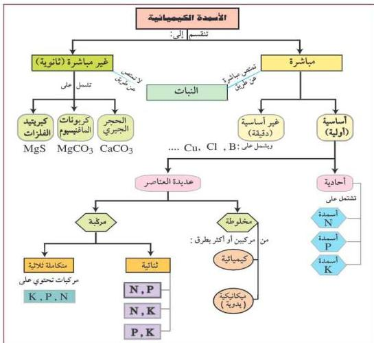

كما أن هناك أسمدة ثنائية تحتوي على عنصرين من العناصر الضرورية لغذاء النبات، وقد تكون الأسمدة ثلاثية إذا احتوت على ثلاثة عناصر، وتُسمَّى حينها بالأسمدة المكتملة. ويوجد صنف آخر يحتوي على أكثر من عنصر مغذي وتُسمَّى بالأسمدة المخلوطة، حيث يمكن الحصول عليها عن طريق خلط عدد من المركبات مع بعضها، أما إذا كانت هذه العناصر متوفرة في مركب واحد فتُسمَّى بالأسمدة المركبة. ويمكن تصنيف الأسمدة، وفقاً للعناصر التي يحتاجها النبات والتي يمكن الحصول عليها من خلال المركبات الموجودة في الأسمدة، كما في الشكل (٨-١).

شكل (٨-١) تصنيف الأسمدة الكيميائية

# ملاحظة

تُصنَّف الأسمدة أحياناً حسب ذوبانها في الماء، فهناك أسمدة تذوب في الماء وأخرى لا تذوب في الماء.

١٤٢

http://www.e-learning-moe.edu.ye/