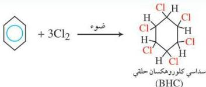
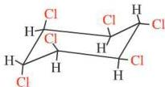

## ملاحظة

أثبتت الدراسات أن الحشرات قد طورت من مقاومتها لهذا المبيد (D.D.T.) بالإضافة إلى ذلك هناك مؤشرات تدل على أن استخدام هذا المبيد له علاقة بأمراض الكبد والسرطان؛ ولذلك حرّمت كثير من الدول استخدامه تلافياً لهذه الأضرار، ولتأثيره السلبي على البيئة وعلى بعض الطيور والأسماك.

ب- مركب BHC (Benzene Hexa Chloride) :

ويعرف هذا المبيد باسم (B.H.C.) "لندان" نسبة إلى مكتشفه، وهو الكيميائي الهولندي فاندير ليندان (Vander Linden)، وهذا المركب هالوجيني، إذ إنه يتكون من حلقة بنزين أضيفت إليها ست ذرات من الكلور.

ولهذا المركب تسع هيئات فراغية، وواحدة منها لها قدرة عالية على قتل الحشرات وتسمى (أيزومرجاما).

## ملاحظة

هناك مجموعة أخرى من المبيدات المشتقة من الكلور مثل (النوكسافين، والكلوردان، وهبتا كلور، والألدرين، والأندرين) وهي من أقوى المبيدات الحشرية، إلا أنه ثبت أن لها أضراراً على الإنسان والحيوان على المدى البعيد، وذلك لأنها تتراكم في جسم الحيوان والإنسان والطيور، ويصعب التخلص منها وتؤدي في النهاية إلى آثار مدمرة على جسم الكائن الحي.

١٤٩

http://www.e-learning-moe.edu.ye/