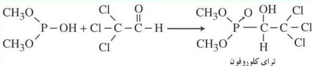
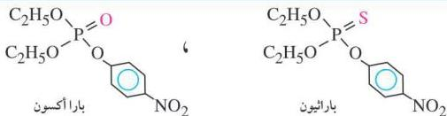

# ٢- مركبات الفسفور:

نتيجة للمخاطر التي يمكن أن تحدث عند استخدام المبيدات المشتقة من الكلور، لجأ العلماء إلى إنتاج مبيدات أخرى تحتوي على مركبات الفسفور العضوية، وتتميز بقدرتها على التحلل في وقت قصير دون أن تترك آثاراً ضارة على البيئة، وهي فعالة جداً في مقاومة الحشرات، إلا أنه ثبت مؤخراً أنها ضارة جداً بالإنسان.

ومن أهم هذه المركبات مركب تراي كلوروفون (Trichlorophon).

تحضيره في الصناعة:

يمكن تحضير مركب تراي كلوروفون، على النحو الآتي:

# ملاحظة

هناك العديد من المبيدات الحشرية الفسفورية، مثل: بارا أوكسون، وباراثيون اللذان يتميزان بوجود رابطة ثنائية ضعيفة بين ذرة الفسفور المركزية وذرة الأكسجين أو الكبريت وأحدى هذه الروابط ضعيفة يمكن كسرها بسهولة، وتسبب زيادة فاعلية المبيد وسرعة تحلله في التربة.

# مبيدات حديثة غير ضارة بالبيئة والإنسان:

تم مؤخراً تطوير بعض المبيدات التي تم استخلاصها من بعض الزهور في أفريقيا الشرقية، والتي تتميز بأن سميتها منخفضة وهي تتحلل بسهولة في وقت قصير.

الاحتياطات الواجب مراعاتها للوقاية من أخطار المبيدات:

١- يجب استشارة المختصين قبل الشروع في استخدام المخصبات أو المبيدات الحشرية.
٢- يجب تدريب العاملين والمزارعين على الطرق الصحيحة لعملية الرش وطرق

١٥٠

http://www.e-learning-moe.edu.ye/