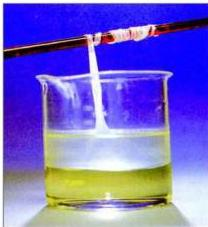

# صناعة النايلون ٦٦ :

يتمُّ صناعة نايلون ٦٦ عن طريق تكاثف حمض الأديبيك مع الهكساميثيلين ثنائي الأمين، لأن المادة الناتجة هي عبارة عن بوليمر، وهو عبارة عن تكرار رابطة الأميد التي تمَّ إبرازها داخل المربعات وسُمِّي نايلون ٦٦ ، أو يسمى "بولي أميد" Poly Amides شكل (٨-٣)، كما في المعادلة الآتية:

شكل (٨-٣) يوضح النايلون ٦٦

$$\begin{array}{c} \text{nHO} - \overset{\text{O}}{\overset{||}{\text{C}}} - (\text{CH}_2)_4 - \overset{\text{O}}{\overset{||}{\text{C}}} - \text{OH} + \text{nH}_2\text{N} - (\text{CH}_2)_6 - \text{NH}_2 \longrightarrow \\ \text{حمض الأديبيك} \hspace{2cm} \text{هكساميثيلين ثنائي الأمين} \\ \left[ \begin{array}{c} \text{O} \\ || \\ -\text{C} - (\text{CH}_2)_4 - \overset{\text{O}}{\overset{||}{\text{C}}} - \text{N} - (\text{CH}_2)_6 - \overset{\text{O}}{\overset{||}{\text{C}}} - (\text{CH}_2)_4 - \overset{\text{O}}{\overset{||}{\text{C}}} - \text{N} - (\text{CH}_2)_6 - \overset{\text{H}}{\overset{|}{\text{N}}} - \text{N} - \end{array} \right] + x\text{H}_2\text{O} \\ \text{حيث } x \text{ تمثل عدد جزيئات الماء الناتجة ، } n \text{ تمثل عدد الجزيئات التي يتشكل منها نايلون} \end{array}$$

وقد اشتهرت خيوط نايلون بحيث أصبح الناس يطلقون على الخيوط الصناعية الأخرى اسم نايلون رغم أنها قد تختلف عنه في تركيبها الكيميائي.

وغالباً تتمُّ صناعة خيوط النايلون عن طريق صهر البولي أميد الناتج من التفاعل السابق، ثم يدفع المصهور خلال مغازل لها ثقوب دقيقة فتتشكّل خيوط النايلون وتتجمد عند تعرضها للهواء ثم تشد هذه الخيوط بمجرد تكوينها إلى ما يعادل أربعة أمثال طولها الأصلي، وهذا يؤدي إلى جعل سلاسل الجزيئات مرتبة بانتظام وبحيث تكون متوازية مما يكسبها سماكة عالية ومتانة قد تعادل سماكة سلك مماثل من الصلب. وتمتاز خيوط النايلون بكونها لا تتأثر بالماء عند غسلها، كما أنها لا تنكمش ولا تحتاج إلى الكي، وهي سريعة الجفاف ولا تنقطع بسهولة عند شدّها.

# نشاط (٨-١)

حضر بوليمر :

١٥٤

http://www.e-learning-moe.edu.ye/