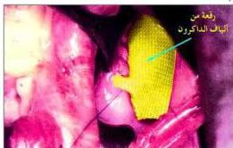
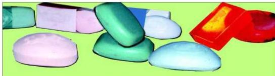

وهذه الرقعة تتميز بأنها غير سامة ولا تثير أي حساسية أو مقاومة من قبل الجسم ولا تؤدي إلى تجلُّط الدم، انظر الشكل (٨-٦).

شكل (٨-٦) استخدام خيوط الداكرون في جراحة القلب

شكل (٨-٥) بدلة مصنوعة من الداكرون

# ملاحظة

يتضح من خلال دراسة التطور العلمي الذي حدث في مجال الألياف الصناعية، أن تطور المعرفة العلمية أدى إلى اكتشاف عملية البلمرة وأدى ذلك إلى تطور التقنيات التي تعتمد على هذه المعرفة فتم تطوير صناعة الألياف مما أدى إلى إنتاج مواد ذات فائدة عظيمة للإنسان مثل ألياف الداكرون والنايلون، وهذا خير دليل على وجود العلاقة الوثيقة بين العلم والتقنية وأثرهما على الإنسان والمجتمع بشكل عام.

# الصناعات الكيميائية للمواد الاستهلاكية:

# ١) صناعة الصابون:

تؤكد الدراسات أن الإنسان تمكّن من صناعة الصابون قبل ٦٠٠ سنة من ميلاد المسيح عليه السلام، إلا أن تركيبته كانت مختلفة تماماً عن الصابون الذي نعرفه حالياً، وهناك شواهد كثيرة تؤكد أن العلماء العرب كانوا أول من توصل لتركيب الصابون الجامد وذلك عن طريق إضافة الكثير من المواد التي أضافت مميزات عديدة كاللون والرائحة.

شكل (٨-٧) ألوان مختلفة للصابون

١٥٧

http://www.e-learning-moe.edu.ye/