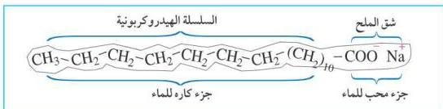
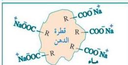

شكل (٨-٨) يوضح آلية عمل الصابون
مستحلب يحتوي على الأوساخ الدهنية وما يعلق بها من أتربة وجزئيات الصابون التي امتزجت بها، ويؤدي ذلك إلى تفكيك جزئيات الدهون وانفصالها عن الملابس، وبالتالي إزالتها بشكل نهائي عن الملابس، حيث يصعب على قطرات الدهن التماسك مع بعضها مرة أخرى بعد تفاعل الصابون معها.

# ملاحظة

يفقد الصابون قدرته على التنظيف في الماء العسر، وذلك لأن الماء العسر يحتوي على أملاح الكالسيوم والمغنيسيوم التي تتفاعل مع الصابون وتكون راسباً لا يذوب في الماء.

# ٢) المنظفات الصناعية:

نظراً لأن إنتاج الصابون يحتاج إلى استهلاك كميات كبيرة من الدهون والزيوت والتي يحتاجها الإنسان للغذاء أو لأغراض أخرى، فقد ازداد الاحتياج إلى إنتاج نوع من الصابون لا يعتمد إنتاجه على الزيوت والدهون وتكون له قدرة على التنظيف حتى في الماء العسر.

وقد تمكن الألمان عام ١٩٣٠م من صناعة أول منظف صناعي سُمي «نيكال» Nekal، ثم انتشرت الفكرة، وتم التوصل عام ١٩٤٦م إلى صناعة صابون «تايد» Tide الذي انتشر استعماله في أنحاء العالم ويستخدم في آلات الغسيل، ولا زال هذا الصابون يستخدم حتى اليوم.

وتتكون المنظفات الصناعية من شقين أحدهما كاره للماء (سلسلة هيدروكربونية R -) وشق محب للماء، إلا أن الشق المحب للماء يختلف في تركيبه عن الشق الذي

١٥٩

http://www.e-learning-moe.edu.ye/