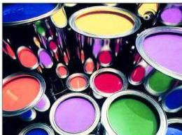

طلاء الإكريليك والتي تمثّل المادة اللاصقة في الطلاء. ومن أهم المكوّنات في الطلاء الزيتي إضافة مادة زيتية تعمل على تكوين مستحلب وتتميز بقدرتها على التطاير،

شكل (٨-٩) يوضح الطلاء

وذلك لتساعد على جفاف مادة الطلاء والتصاقه بالسطح، انظر الشكل (٨-٩). ومن أهم الزيوت التي تضاف للطلاء الزيتي هو زيت فصول الصويا، وزيت الخروع، وزيت جوز الهند. كما تضاف مادة مذيبة للطلاء، ومن أهم المذيبات مادة التوربنتين "Turpentine".

### كيف يتم جفاف الطلاء المائي والزيتي؟

- بالنسبة للطلاء المائي يبدأ الماء بالتبخر بمجرد وضع مادة الطلاء على السطح وتزداد كمية الماء التي تفقد بالتبخر كلما كان السطح معرضاً للهواء وكلما كانت درجة حرارة الجو مرتفعة. وعندما يفقد الطلاء جزءاً من الماء يبدأ مستحلب الطلاء بالتفكك فيساعد ذلك على سرعة جفاف طبقة الطلاء والتصاقه بالسطح.
- أما بالنسبة للطلاء الزيتي فيجفّ نتيجة لعدة عوامل، حيث تبدأ المادة المذيبة - وهي غالباً مادة التوربنتين - بالتطاير، وبالتالي تبقى مادة الطلاء التي تلتصق بالسطح. وهناك آلية أخرى تساعد على جفاف الطلاء، حيث أن الزيوت المضافة للطلاء ( زيت الخروع، وزيت الصويا) تتفاعل مع أكسجين الهواء الجوي وتكوّن طبقة من الأكسيد الذي يساعد على جفاف الطلاء.
وتحدث عملية أكسدة الزيوت الموجودة بالطلاء عن طريق استبدال ذرة الهيدروجين الموجودة على ذرة الكربون المجاورة للرابطة المزدوجة والموجودة في جزيء الحمض الدهني غير المشبع، حيث تستبدل ذرتي هيدروجين بذرة أكسجين لتكوّن جسراً بين جزيئين من مادة الحمض الدهني، وفقاً للمعادلة الآتية:

$$\begin{array}{c} -\text{CH}_2 - \text{CH}_2 - \text{CH} = \text{CH} - \text{CH}_2 - \\ \text{جزء من مركب الزيت} \end{array} \begin{array}{c} -\text{CH}_2 - \text{CH} - \text{CH} = \text{CH} - \text{CH}_2 \\ + \text{O}_2 \longrightarrow \text{O} \\ -\text{CH}_2 - \text{CH}_2 - \text{CH} = \text{CH} - \text{CH}_2 - \\ \text{جزء آخر من مركب الزيت} \end{array} + \text{H}_2\text{O}$$

١٦٤

http://www.e-learning-moe.edu.ye/